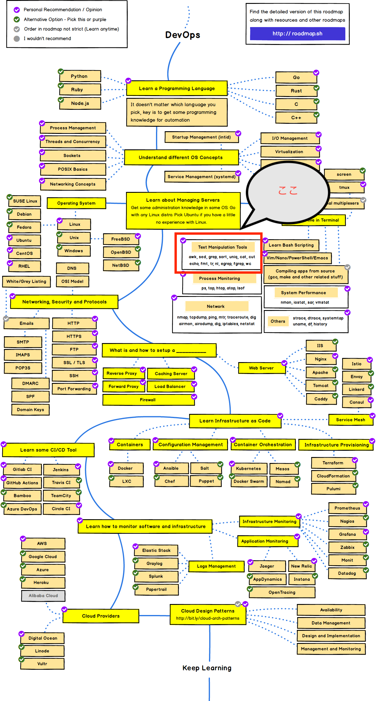

# DevOpsロードマップ(テキスト処理)

## 概要

DevOpsエンジニアのロードマップにしたがって、基本コマンドのおさらいをします。

今回はSysOpsの領域で、テキストデータの処理を学習します。

`grep` `cat` `grep` `tr` `wc` などはあまり書けそうなことがないため、コマンドというよりプログラミング言語と言える `awk` や `jq` について記載していきます

基本的な分野となりますが、ログ集計・データ作成等がさっとできないとお話にならないので、さくっと学習します。(入り込めばシェル芸の沼にはまりそうなので)

## 目次

- [awk](awk/awk.md)
- [jq](jq/jq.md)

